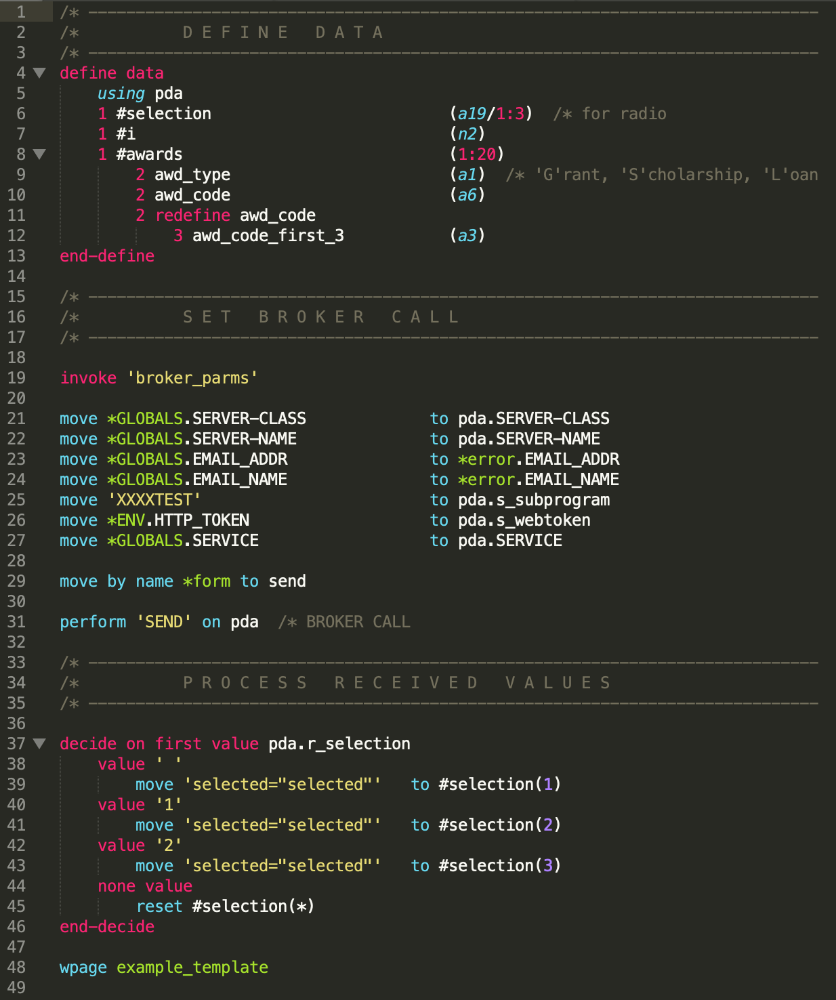

# webAgent Syntax
Syntax highlighting for the "webAgent" language in Sublime Text.



## Installation
You can install this package from Package Control (recommended) or manually. Package Control will automatically keep the package up-to-date. Manual installation is required if you want to edit the code or contribute.

### Install via Package Control
1. [Install Sublime Package Control](https://packagecontrol.io/installation).
2. In Sublime Text, open the Package Control command palette by pressing `ctrl+shift+p` (Win, Linux) or `cmd+shift+p` (Mac).
3. Type "Package Control: Install Package" and hit return. A list of available packages will be displayed.
4. Type "webAgent" and hit return. The package will be installed.

### Install manually
1. In Sublime Text, select "Preferences" > "Browse Packages". This opens your Sublime Text package directory.
2. Clone this repo to your Sublime Text package directory.

## Notes
### Word boundaries in webAgent
A "word boundary" is the boundary between a word character and a non-word character. RegEx has a symbol for word boundaries, `\b`. RegEx considers these characters to be "word characters": `a-z, A-Z, 0-9, _`. In webAgent, the hyphen should also be considered a word character (it's used the same way an underscore is used). Since webAgent's word characters differ from RegEx, we can't use rely on `\b` to find word boundaries.

To find word boundaries in webAgent, we use lookaheads and lookbehinds that include hyphens as word characters:
```
# ADD keyword
- match: (?i)(?<![\w-])add(?![\w-])
```
1. `(?i)` modifies the mode of RegEx to be case-insensitive.
2. `(?<![\w-])` is a negative lookbehind that will discard a result if it's preceded by any of these characters: `a-z, A-Z, 0-9, _, -`. E.G. `#VARIABLE-TO-ADD` will not match `ADD` because it's preceded by a hyphen.
3. `add` is the main expression of what to match.
4. `(?![\w-])` is a negative lookahead that will discard a result if it's followed by any of these characters: `a-z, A-Z, 0-9, _, -`. E.G. `#ADD-VARIABLE` will not match `ADD` because it's followed by a hyphen.
